# Sample application

## Introduction
To showcase Nimbus, we developed a small application that uses it for creating server-driven
screens.

The sample is an online store app with a bottom navigation bar and 7 server-driven screens.

## Screens

### Products
This screen lists all the products in the store. By clicking a product image you go to the details of it, by clicking
"Add to cart", it adds the product to the shopping cart.

When a product is added to the cart, a counter notification at the top of the menu item "cart" changes its value, this
has been done by observing the global state, which stores the cart. For formatting the price we used a custom operation named
"formatPrice". When the list of products is loading, we used a custom component named "Spinner" to show an animation.

When the request to the list of products finishes and the result is displayed, each product in the list is rendered using the
components provided by the lib Nimbus Layout. To show a loading animation before the content, we used the structural component
"if". To iterate over the list once it was available, we used the structural component "forEach". Both "if" and "forEach" are 
core parts of Nimbus and don't need additional libraries.

  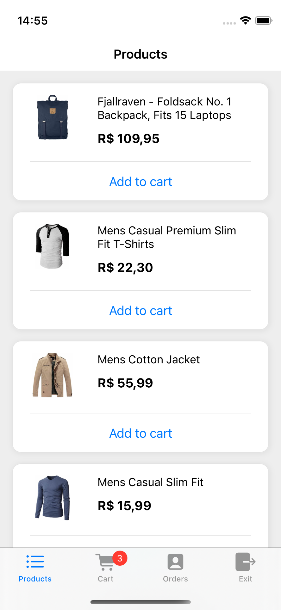
  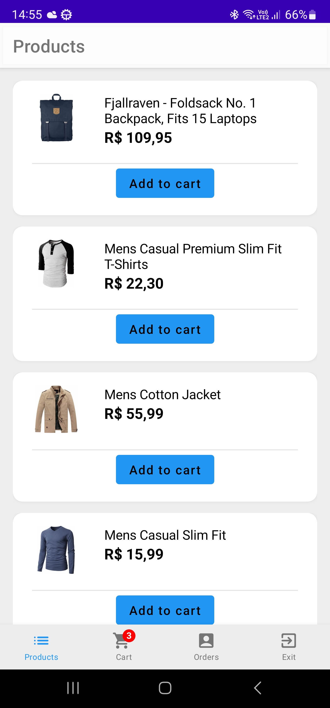

### Product details
Shows the details of a product, it receives the product as a screen parameter.

  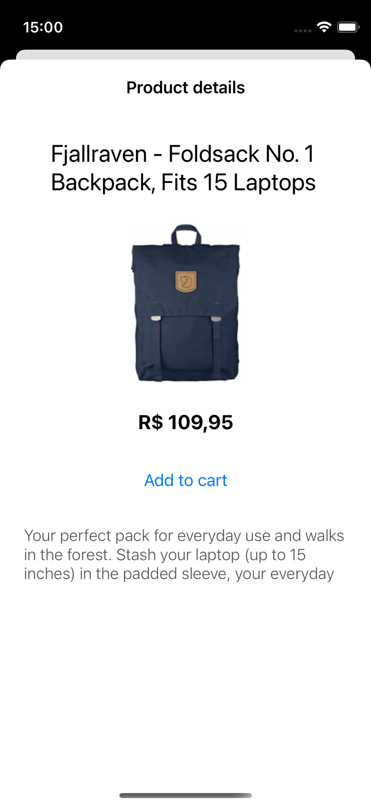
  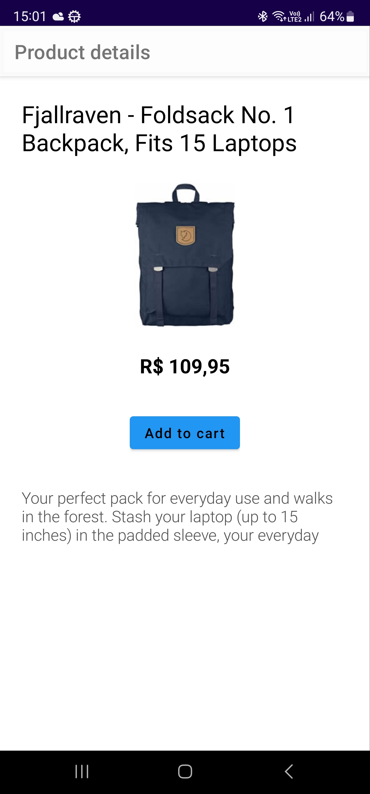

### Shopping cart
Shows every product in the shopping cart. The shopping cart is part of the Global State, i.e. it can be accessed and
modified from anywhere in the application. By clicking the button "Buy", the user is redirected to the screen for
filling an address.

  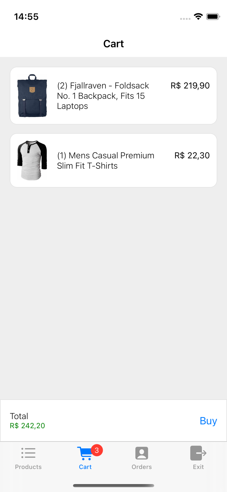
  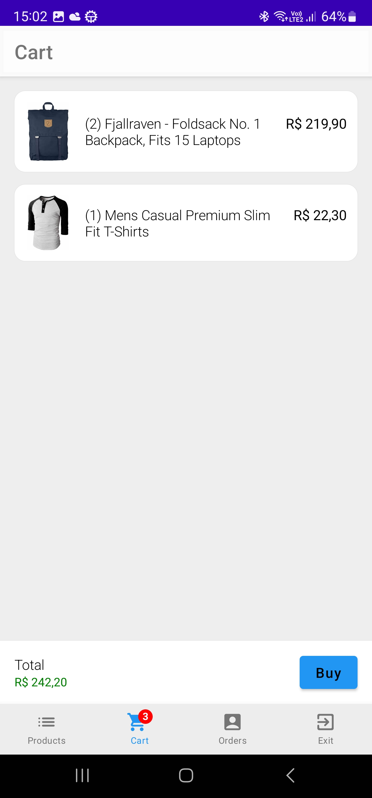

### Address
A form for submitting an address. The interesting part here is that when the zip-code is filled, a request is made
to a zip-code API and the rest of the address is auto-filled by the response.

By clicking "Next", the address is passed as a parameter to the next screen: payment.

  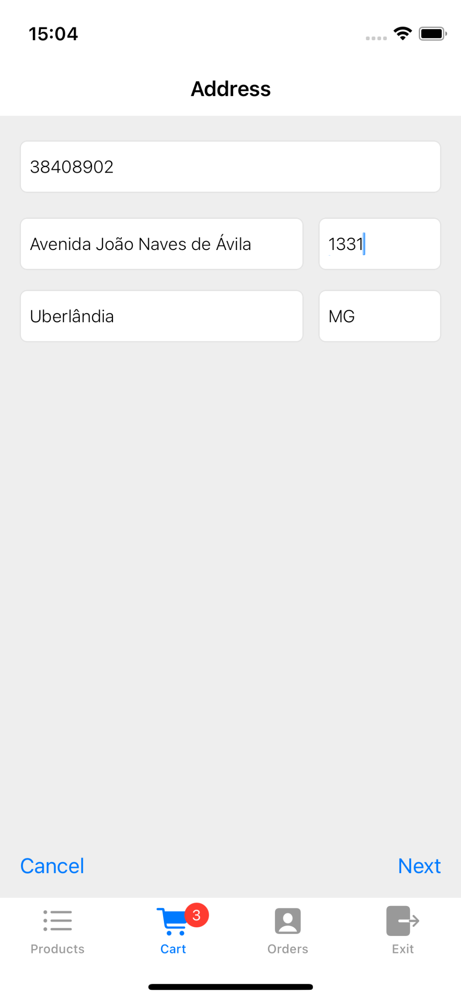
  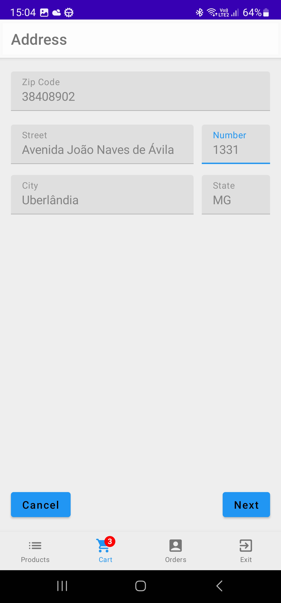

### Payment
Very similar to the address form. It completes the form and submits its data in a POST request to the backend. When
the request succeeds, it redirects the user to the page that lists all orders.

  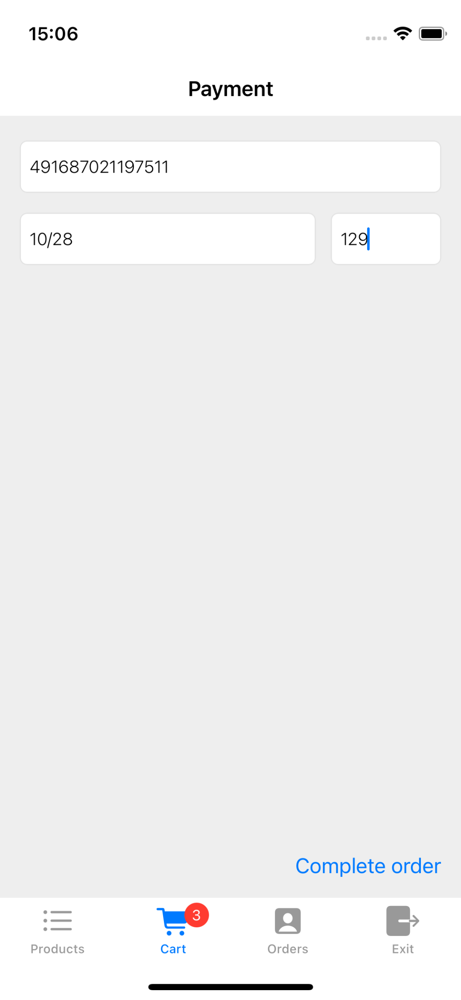
  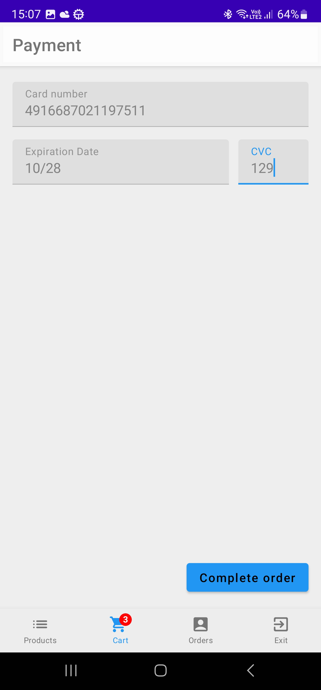

### Orders
Lists all orders placed by the user. By clicking on an order, its details are presented.

  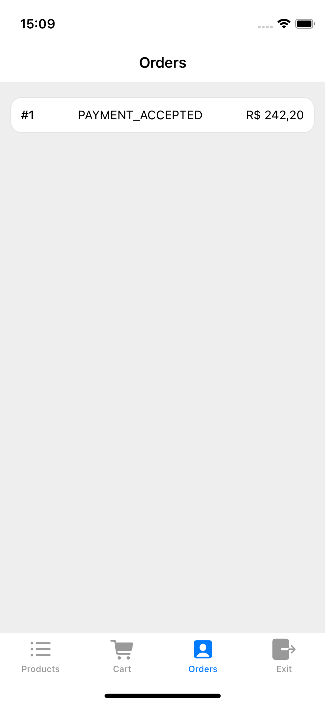
  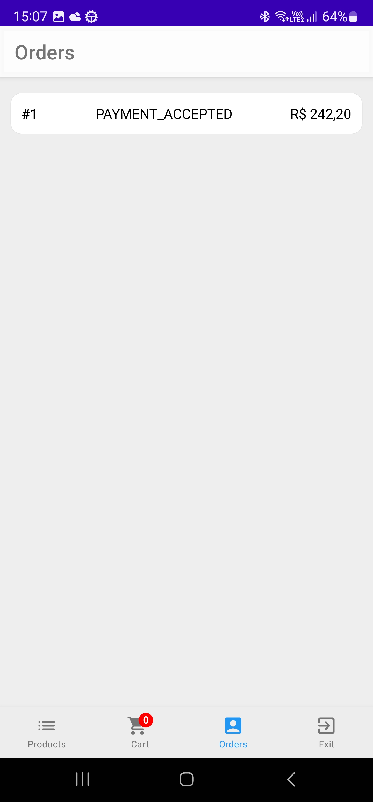

### Order details
Shows the details of the order. It receives the order as a screen parameter.

  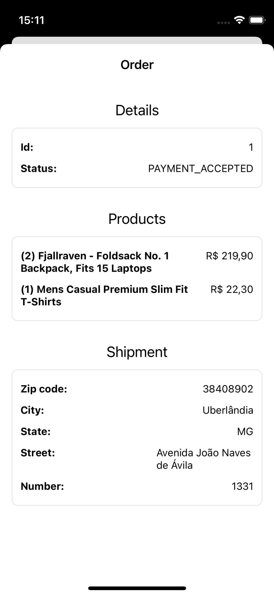
  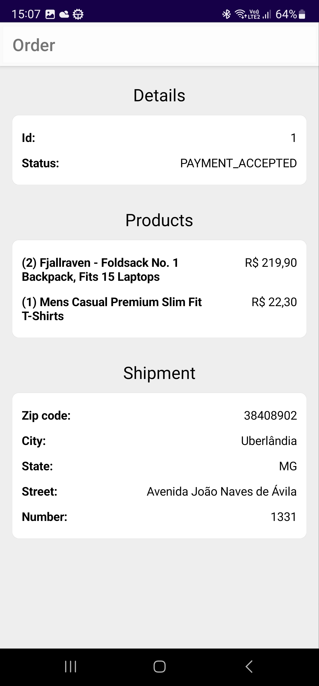

## Sample projects
- Backend: https://github.com/ZupIT/nimbus-backend-ts/tree/main/sample
- Android: https://github.com/ZupIT/nimbus-layout-compose/tree/main/store
- iOS: https://github.com/ZupIT/nimbus-layout-swiftui/tree/main/Store
