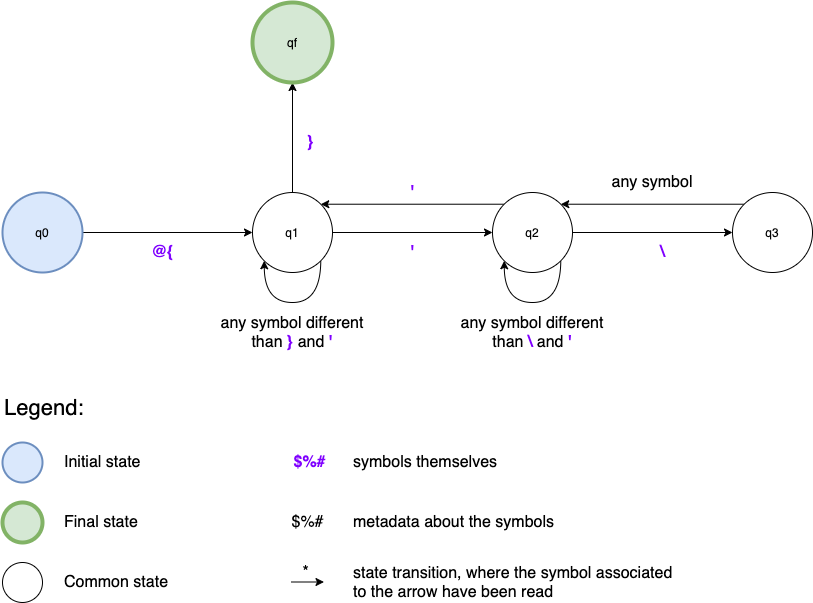
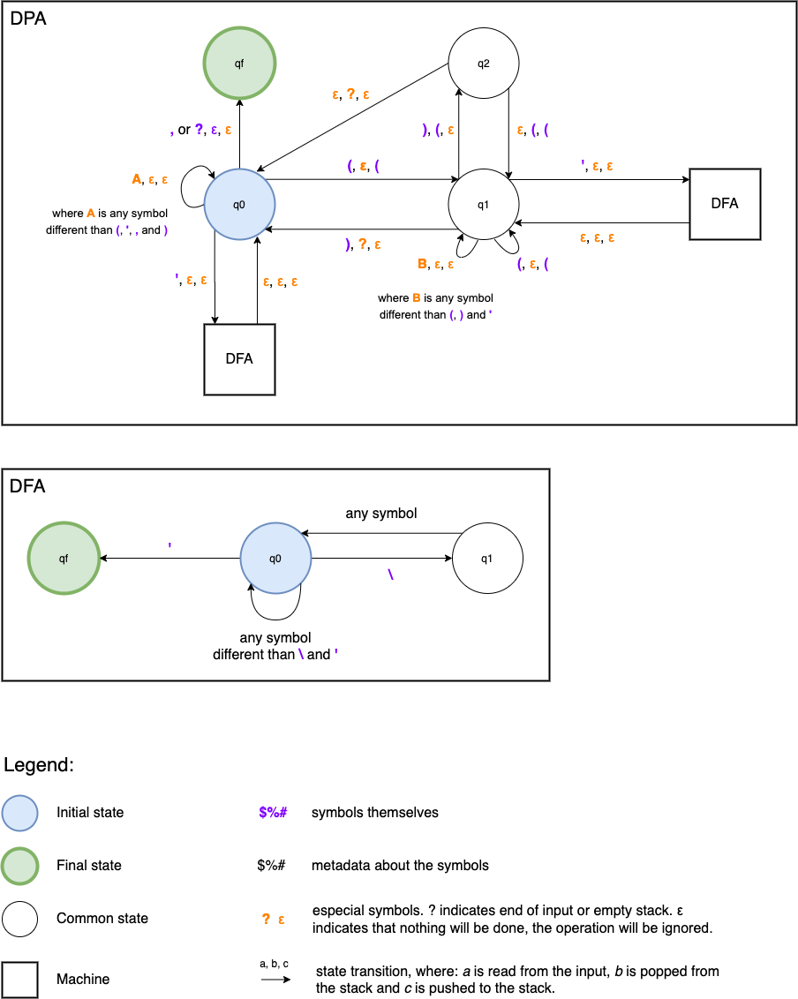

# Expressions
Component properties or Action properties can be dynamic, i.e. they can vary according to a state. To use state values instead of hardcoded values,
we use expressions.

A simple example is a screen with a text input and a paragraph below it. If we say the paragraph needs to show the exact content typed into the
text input, then we must use state and expressions. See the examples below:

Hardcoded: the text won't change.
```json
{
  "_:component": "layout:column",
  "children": [
    {
      "_:component": "layout:textInput",
      "properties": {
        "placeholder": "Type the text here",
        "value": "Hardcoded value"
      }
    },
    {
      "_:component": "layout:text",
      "properties": {
        "text": "Hardcoded value"
      }
    }
  ]
}
```

Dynamic: the text changes according to the input:
```json
{
  "_:component": "layout:column",
  "state": {
    "id": "text",
    "value": ""
  },
  "children": [
    {
      "_:component": "layout:textInput",
      "properties": {
        "placeholder": "Type the text here",
        "value": "@{text}",
        "onChange": [{
          "_action": "setState",
          "path": "text",
          "value": "@{onChange}"
        }]
      }
    },
    {
      "_:component": "layout:text",
      "properties": {
        "text": "@{text}"
      }
    }
  ]
}
```

Expressions are everything between `@{` and `}` in a string. These marks can be scaped with the character `\` if necessary. Expressions can refer to
a [state](state.md), part of a state or execute an [operation](operation.md). See the examples below:

- State: `"@{person}"`
- Part (member) of a state: `"@{person.name}"`
- Array access: `"@{person.documents[0]}"`
- Operation: `"gt(person.age, 18)"`

## Grammar
**This topic is not important unless you are implementing this feature or really want to know how expressions are built.**

To recognize and parse an expression, we must define the grammar that recognizes the language representing every possible Nimbus expression.

If the language that rules expressions was regular, then it would be simple, we'd be able to use a regular expression. This is not the case though,
expressions may be comprised of operations and the number of opening parenthesis must be equal to the number of closing parenthesis. This means the
grammar must be capable of counting, i.e., it needs some kind of memory. Regular grammars are equivalent to Finite Automatons, they don't have any
kind of memory, and for this reason, this language is not regular. A formal proof of this can be found in any book with the subject
"Theory of Computing".

The next classification of languages is "Context free languages". Context free grammars are equivalent to
[Push Down Automatons (PDA)](https://en.wikipedia.org/wiki/Pushdown_automaton). If we can build a PDA, then our language is context free. We're not
going to go through another formal proof here. We know we can build a PDA and we'll present it in this section.

### Formal grammar definition
In the code below, we use "`" to group symbols and "/" to represent regular expressions. "|", outside a regular expression, means or.

```
Expression = @{Operation | Value}
Operation = Name(`Params | )`
Name = /\w[\w\d_]*/
Params = `Param,Params` | Param)
Param = Operation | Value
Value = State | Literal
State = /^(?!(true$|false$|null$|'|\d))[a-z|A-Z|_](\w|(\[\d+\])|(\.\w))*$/
Literal = String | Number | true | false | null
String = /^'([^'\\]|(\\.))*'$/
Number = /^\d+$/
```

### The Automatons
For better performance and code-readability, we won't use a DPA to recognize the entire language. Instead, we'll only use a DPA for the part of the
expression that actually needs it: the parameters of an operation, including its parenthesis.

First, we can identify the expressions before trying to process them. If we just want to identify a possible expression we can use
regular expressions. Once we recognize that an expression may exist within the string, we can process it. For instance, `@{operation(abc}` is wrong,
but when traversing the JSON we can recognize it as an expression and see that it's wrong only when parsing it. This is advantageous because by using
a simple regular expression first, we don't need to run our DPA over the entire payload, but just on strings that might be a valid word of our
language.

To recognize a candidate expression, we can use the following Deterministic Finite Automaton (DFA):



The DFA above can be translated o the following regular expression: `/@{(([^'\}]|('([^'\\]|\\.)*'))*)}/`.

Once we identified a candidate expression, we can begin to process it according to the grammar described in the previous section. We are interested
only in the content between `@{` and `}`, i.e. the first capture group of the regex.

The following code is written in Typescript and illustrates how we can run a DPA only when needed, i.e., only when we want to parse an operation.

```typescript
function evaluateExpression(expression: string, stateHierarchy: State[]) {
  const literalValue = getLiteralValue(expression) // returns null if expression is not a literal
  if (literalValue) return literalValue

  const isOperation = expression.includes('(')
  if (isOperation) return getOperationValue(expression, contextHierarchy)

  // otherwise, it's a state reference
  return getStateValue(expression, contextHierarchy)
}
```

The challenging part of the code above is `getOperationValue`. This function is responsible to parse the operation and execute it, i.e. we need to get
the string we receive and, from it, determine what is the operation name and what is the list of parameters. See the example below:

`condition(lte(counter, 5), 'greater or equal to 5', 'less than 5')`

we can use the regular expression `/^(\w[\w\d_]*)\((.*)\)$/` to separate the operation name from the parameter string:

```typescript
const match = "condition(lte(counter, 5), 'greater or equal to 5', 'less than 5')".match(/^(\w[\w\d_]*)\((.*)\)$/)
const operationName = match[1]
const parameterList = match[2]
```

We now reduced by a lot our problem, it lies in `parameterList`. How to transform it into an array with each parameter for the operation? Since a
parameter can be another operation, we can't do a simple `parameterList.split(',')`. We have to be able to count the parenthesis, which means,
there's no regular expression to separate these parameters. We'll need at least a DPA to solve this problem.

We can use the following DPA to recognize a parameter inside a parameter list. Each time the final state is reached, a parameter has been recognized.
The DPA must be executed until the end of `parameterList` is reached, each time a pattern is correctly identified, we should add the string identified
to the array of parameters.



In the diagrams above, the first machine identifies a parameter inside the parameter string while the second just checks if it is inside a string.
The second machine is a DFA and can be a regular expression when implementing.

With this we have all means to process every expression. We just need to call `evaluateExpression` for each one of the parameters and after resolving
all of them, execute the function referenced by the operation name.

### Important observations

- false, true and null are literals and can't be used as state ids.
- literals can not be objects (maps) or arrays.
